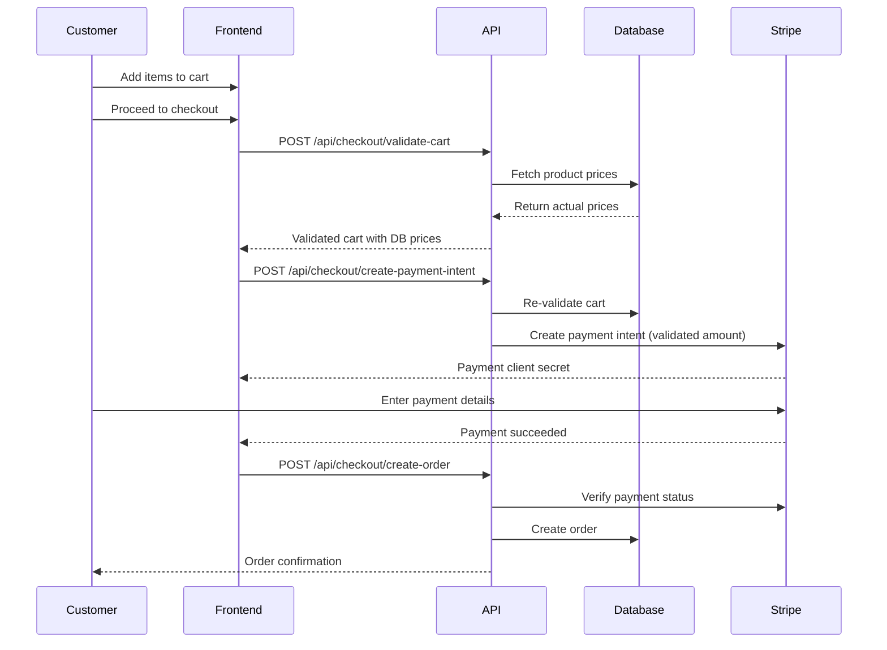

# Payment Security Guide

**Kollect-It Marketplace - Secure Checkout Implementation**

---

## 🔒 Overview

The Kollect-It checkout system implements **server-side validation** to prevent common e-commerce security vulnerabilities, especially **price tampering** and **payment fraud**.

### Why This Matters

**Without server-side validation:**

- Malicious users can modify JavaScript to change prices
- $1000 product could be purchased for $1
- Inactive products could be purchased
- Invalid quantities could cause inventory issues

**With server-side validation (our implementation):**

- ✅ All prices verified against database
- ✅ Product availability checked in real-time
- ✅ Quantities validated before payment
- ✅ Client-side prices completely ignored

---

## 🛡️ Security Flow

### Complete Checkout Flow



---

## 📝 Implementation Details

### 1. Cart Validation Endpoint

**Route**: `POST /api/checkout/validate-cart`

**Purpose**: Validates cart items against database

**Request:**

```json
{
  "items": [
    {
      "productId": "clx123abc",
      "quantity": 2,
      "price": 1500.00  // ❌ This is IGNORED!
    }
  ]
}
```

**Response (Success):**

```json
{
  "valid": true,
  "items": [
    {
      "productId": "clx123abc",
      "title": "Vintage Map",
      "price": 1500.00,  // ✅ Database price used
      "quantity": 2,
      "lineTotal": 3000.00
    }
  ],
  "subtotal": 3000.00,
  "tax": 240.00,
  "shipping": 0.00,
  "total": 3240.00
}
```

**Response (Error):**

```json
{
  "error": "Product is no longer available"
}
```

### What Gets Validated

| Check | Description | Error if... |
|-------|-------------|-------------|
| **Product Exists** | Verifies product ID in database | Product not found |
| **Product Active** | Checks `status === 'active'` | Product deleted/inactive |
| **Quantity Valid** | Ensures 1 ≤ quantity ≤ 99 | Invalid quantity |
| **Price Match** | Fetches current price from DB | Always uses DB price |

### 2. Payment Intent Creation

**Route**: `POST /api/checkout/create-payment-intent`

**Security Steps:**

```typescript
// Step 1: Validate cart (get database prices)
const validatedCart = await fetch('/api/checkout/validate-cart', {
  method: 'POST',
  body: JSON.stringify({ items })
});

// Step 2: Create Stripe payment intent with VALIDATED amount
const paymentIntent = await stripe.paymentIntents.create({
  amount: formatAmountForStripe(validatedCart.total), // ✅ DB price
  currency: 'usd',
  // ... other options
});
```

**Key Points:**

- Client-provided prices are **never** used
- Cart is validated **every time** before charging
- Payment amount comes from database, not client

### 3. Order Creation

**Route**: `POST /api/checkout/create-order`

**Final Verification:**

```typescript
// Verify payment succeeded
const paymentIntent = await stripe.paymentIntents.retrieve(paymentIntentId);

if (paymentIntent.status !== 'succeeded') {
  return error('Payment not completed');
}

// Create order only after payment confirmed
const order = await prisma.order.create({
  // ... order data
});
```

---

## 🎯 Security Best Practices

### ✅ What We Do

1. **Server-Side Validation**
   - All prices fetched from database
   - Client prices completely ignored
   - Products validated as active before purchase

2. **Payment Verification**
   - Verify payment succeeded before creating order
   - Check Stripe payment intent status
   - Duplicate order prevention

3. **Real-Time Checks**
   - Product availability checked at payment time
   - Inventory status verified
   - Price changes reflected immediately

4. **Secure Metadata**
   - Order details stored in Stripe metadata
   - Used for order recovery if needed
   - Helps with Stripe Dashboard reporting

### ❌ What We DON'T Do

1. **Trust Client Data**
   - Never use client-provided prices
   - Never trust quantity without validation
   - Never assume products still exist

2. **Expose Sensitive Info**
   - Card details never touch our server
   - PCI compliance via Stripe Elements
   - Payment info stays with Stripe

3. **Allow Race Conditions**
   - Duplicate orders prevented
   - Concurrent order creation handled
   - Payment intent reuse blocked

---

## 🧪 Testing Security

### Test 1: Price Tampering

**Attempt to pay $1 for a $1000 product:**

```bash
curl -X POST http://localhost:3000/api/checkout/validate-cart \
  -H "Content-Type: application/json" \
  -d '{
    "items": [
      {
        "productId": "real-product-id",
        "quantity": 1,
        "price": 1.00
      }
    ]
  }'
```

**Expected Result:**

```json
{
  "valid": true,
  "items": [{
    "price": 1000.00  // ✅ Database price used, not $1
  }],
  "total": 1080.00  // $1000 + 8% tax
}
```

### Test 2: Inactive Product

**Attempt to purchase deleted product:**

```bash
curl -X POST http://localhost:3000/api/checkout/validate-cart \
  -H "Content-Type: application/json" \
  -d '{
    "items": [
      {"productId": "deleted-product-id", "quantity": 1}
    ]
  }'
```

**Expected Result:**

```json
{
  "error": "Product not found"
}
```

### Test 3: Invalid Quantity

**Attempt to purchase -5 items:**

```bash
curl -X POST http://localhost:3000/api/checkout/validate-cart \
  -H "Content-Type: application/json" \
  -d '{
    "items": [
      {"productId": "real-product-id", "quantity": -5}
    ]
  }'
```

**Expected Result:**

```json
{
  "error": "Invalid quantity for \"Product Name\""
}
```

---

## 🚨 Common Attack Vectors (Prevented)

### 1. Client-Side Price Modification

**Attack:** User modifies JavaScript to change prices in cart

**Prevention:**

```typescript
// ❌ VULNERABLE CODE (don't do this)
const total = items.reduce((sum, item) => 
  sum + item.price * item.quantity, 0
);

// ✅ SECURE CODE (what we do)
const validatedCart = await validateCartServerSide(items);
const total = validatedCart.total; // From database
```

### 2. Purchasing Deleted Products

**Attack:** User saves product URL, product gets deleted, user tries to buy

**Prevention:**

```typescript
if (product.status !== 'active') {
  return error('Product no longer available');
}
```

### 3. Negative Quantities

**Attack:** User sets quantity to -1000 to get refund

**Prevention:**

```typescript
if (quantity < 1 || quantity > 99) {
  return error('Invalid quantity');
}
```

### 4. Order Without Payment

**Attack:** User calls create-order API directly without paying

**Prevention:**

```typescript
const paymentIntent = await stripe.paymentIntents.retrieve(paymentIntentId);
if (paymentIntent.status !== 'succeeded') {
  return error('Payment not completed');
}
```

---

## 📊 Security Metrics

### What Gets Logged

```typescript
console.log('Cart validation:', {
  itemCount: items.length,
  clientTotal: clientCalculatedTotal, // What client claimed
  serverTotal: validatedTotal,        // What database says
  difference: Math.abs(clientTotal - serverTotal),
  tampered: difference > 0.01 ? 'YES' : 'NO'
});
```

### Monitoring for Fraud

Watch for:

- Multiple validation failures from same IP
- Large price discrepancies (client vs server)
- Attempts to purchase inactive products
- Invalid quantity patterns
- Repeated failed payments

---

## 🔧 Configuration

### Tax Calculation

Current: 8% sales tax (hardcoded)

To change:

```typescript
// src/app/api/checkout/validate-cart/route.ts
const tax = subtotal * 0.08; // Change 0.08 to your rate
```

### Shipping Calculation

Current: Free shipping

To add shipping costs:

```typescript
// Calculate shipping based on cart value or weight
const shipping = calculateShipping(validatedCart);
```

### Quantity Limits

Current: 1-99 items per product

To change:

```typescript
if (quantity < 1 || quantity > 99) { // Change 99 to your max
  return error('Invalid quantity');
}
```

---

## ✅ Production Checklist

Before deploying to production:

- [ ] Test price tampering prevention
- [ ] Test inactive product rejection
- [ ] Test quantity validation
- [ ] Verify Stripe webhook configured
- [ ] Monitor failed validation attempts
- [ ] Set up fraud detection alerts
- [ ] Test order creation after payment
- [ ] Verify duplicate order prevention
- [ ] Check database price accuracy
- [ ] Test tax calculation correctness

---

## 📚 Related Documentation

- [STRIPE_SETUP.md](./STRIPE_SETUP.md) - Stripe integration
- [ORDER_MANAGEMENT_GUIDE.md](./ORDER_MANAGEMENT_GUIDE.md) - Managing orders
- [API_INTEGRATION_GUIDE.md](./API_INTEGRATION_GUIDE.md) - API setup

---

## 🆘 Security Issues

If you discover a security vulnerability:

1. **DO NOT** create a public GitHub issue
2. Email security concerns privately
3. Provide details of the vulnerability
4. Allow time for fix before disclosure

---

**Last Updated**: October 24, 2025
**Version**: 115
**Status**: ✅ Production Ready with Enhanced Security

**The payment system is now hardened against common e-commerce attacks!**
